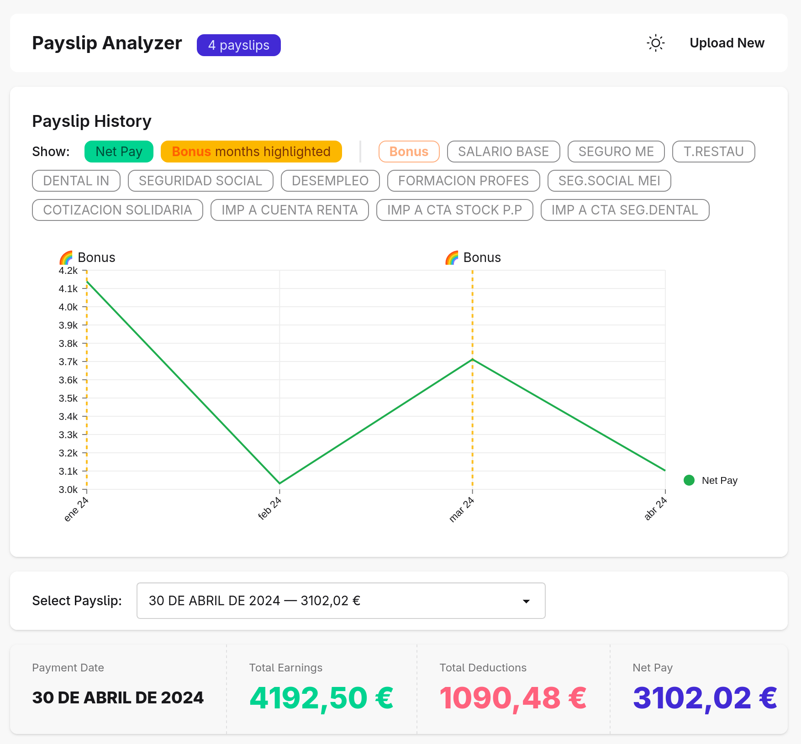
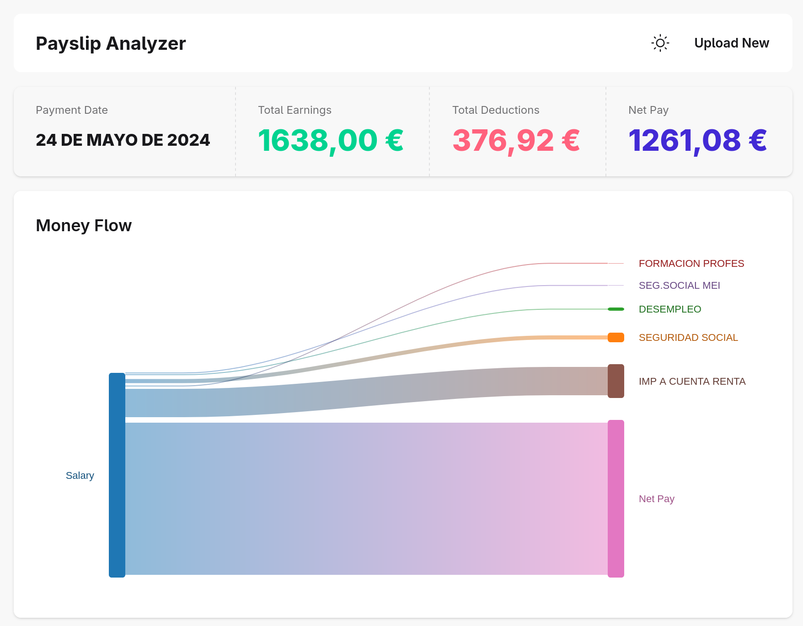

# ADP Payslip Analyzer

A client-side tool to make sense of your Spanish ADP payslips. Upload your PDFs, see where your money goes, and track trends over time. All processing happens in your browser - your payslip data never leaves your machine.

**[Try it live](https://mrmarble.github.io/adp-payslip-analyzer/)**



## Features

- **Privacy-first** - 100% client-side, no server, no uploads
- **Multi-payslip trends** - Track net pay over time, spot bonus months
- **Money flow visualization** - Sankey chart shows exactly where your salary goes
- **Concept breakdown** - Understand cryptic ADP codes (SEGURIDAD SOCIAL, anyone?)
- **Dark mode** - Easy on the eyes



## Usage

1. Go to the [live demo](https://mrmarble.github.io/adp-payslip-analyzer/)
2. Drop your ADP payslip PDFs (or click to browse)
3. Explore your earnings, deductions, and trends

## Development

```bash
npm install
npm run dev        # Start dev server
npm run demo       # Dev server with mock data (no real PDFs needed)
npm run build      # Production build
npm run test       # Run tests
```

## License

Licensed under **The "Better Ask The LLM" License (BATL)** - Software offered "as is, maybe" with no warranties or guarantees. Use at your own risk, and when in doubt, better ask the LLM!

See [LICENSE](LICENSE) for details.
